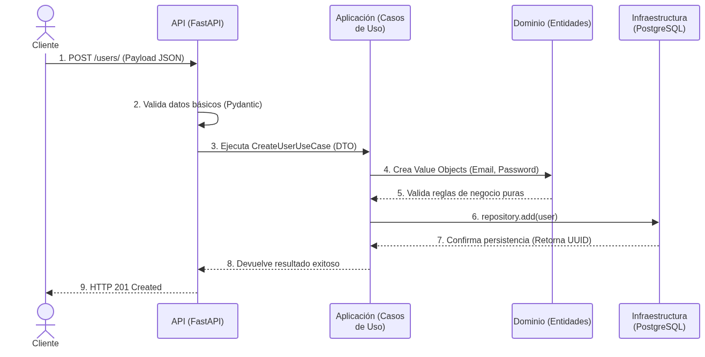

# Análisis de Clean Architecture
**Repositorio:** `alefeans/python-clean-architecture`

## 1. Flujo general de una petición
En Clean Architecture, el flujo de una petición sigue la **Regla de Dependencia**: el código fuente solo puede apuntar hacia adentro, hacia las capas de más alto nivel (el dominio). El flujo general de una petición es:

1. **Agente Externo (Cliente):** Realiza una petición HTTP.
2. **Capa de Presentación (Controlador/API):** Recibe la petición, valida el formato inicial y la pasa a la capa de aplicación.
3. **Capa de Aplicación (Casos de Uso):** Contiene la lógica de orquestación. Recibe la petición, solicita datos a la infraestructura si es necesario, y aplica la lógica.
4. **Capa de Dominio (Entidades/Value Objects):** Contiene las reglas de negocio puras. La aplicación interactúa con esta capa para validar que la operación es correcta.
5. **Capa de Infraestructura (Base de Datos/Adaptadores):** Se encarga de la persistencia real o de comunicarse con servicios externos. Devuelve la confirmación hacia afuera.

## 2. Capas presentes en el proyecto
Al analizar el repositorio, se evidencia una separación clara usando Domain-Driven Design (DDD) y FastAPI. Las capas están implementadas así:

*   **Dominio (`domain`):** Presente. Contiene entidades, excepciones de dominio, interfaces de los repositorios y Value Objects (como `Email`, `Password`, y validaciones con UUID).
*   **Aplicación (`application`):** Presente. Contiene los DTOs y la implementación de las operaciones CRUD (como `CreateUserUseCase`). Usa el patrón Unit of Work.
*   **Presentación (`api` / `presentation`):** Presente. Implementada con los routers de FastAPI, la inyección de dependencias y la configuración de OAuth2 + JWT.
*   **Infraestructura (`infrastructure`):** Presente. Contiene la conexión a PostgreSQL, migraciones con Alembic, modelos ORM con SQLModel y las implementaciones concretas de los repositorios.

## 3. Flujo de una petición según los componentes del proyecto
*Ejemplo: Petición POST para crear un nuevo usuario (`/users/`)*

1. **Cliente:** Envía un JSON con email y password al endpoint de FastAPI.
2. **Router (FastAPI):** Recibe el payload y valida los tipos de datos básicos usando esquemas de Pydantic.
3. **Inyección de Dependencias:** FastAPI inicializa el `UnitOfWork` y el repositorio concreto.
4. **Caso de Uso (Application):** Se ejecuta `CreateUserUseCase` recibiendo el DTO.
5. **Validación de Dominio:** El caso de uso crea los Value Objects. Si el formato es inválido, el dominio lanza una excepción.
6. **Persistencia (Infrastructure):** El caso de uso llama a `repository.add(user)`. El ORM (SQLModel) mapea la entidad a la tabla de Postgres y guarda el registro.
7. **Respuesta:** El caso de uso retorna el UUID generado hacia el router, y FastAPI responde con un código HTTP 201.

### Diagrama de Flujo de la Petición

